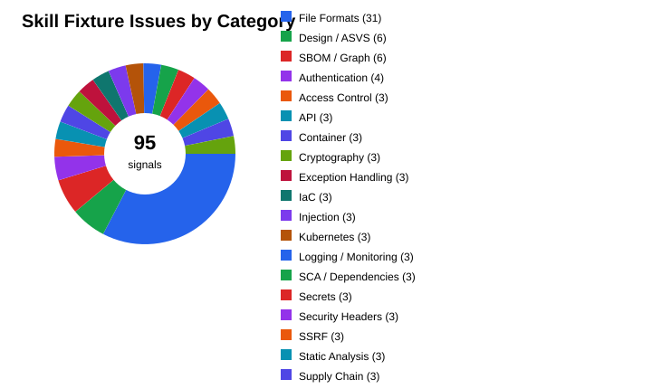
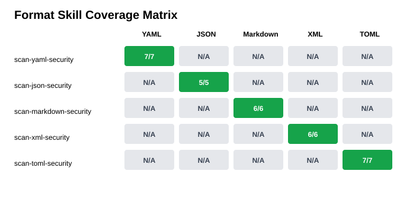

# Skill Fixture Test Report

Generated locally on 2026-05-31T06:22:35.7557144Z.

## Summary

| Metric | Count |
|--------|-------|
| Skills tested | 26 |
| Skill contract checks passed | 26 |
| Skill contract checks failed | 0 |
| Rules validated | 2981 |
| Expected fixture signals | 95 |
| Skill invocation issues found | 95 |
| Direct binary matches found with `rg -F` | 95 |

## Skill Contract Validation

| Skill | Rules | Status | Notes |
|-------|-------|--------|-------|
| audit-asvs-compliance | 345 | Pass | OK |
| audit-auth-session-management | 12 | Pass | OK |
| audit-crypto-usage | 12 | Pass | OK |
| audit-logging-monitoring | 12 | Pass | OK |
| detect-secrets | 393 | Pass | OK |
| detect-supply-chain-risks | 20 | Pass | OK |
| generate-dependency-graph | 10 | Pass | OK |
| generate-sbom | 10 | Pass | OK |
| scan-api-security | 6 | Pass | OK |
| scan-broken-access-control | 12 | Pass | OK |
| scan-container-image | 128 | Pass | OK |
| scan-exception-handling | 10 | Pass | OK |
| scan-for-injection | 7 | Pass | OK |
| scan-for-ssrf | 8 | Pass | OK |
| scan-for-xss | 12 | Pass | OK |
| scan-iac-security | 1746 | Pass | OK |
| scan-json-security | 5 | Pass | OK |
| scan-kubernetes-manifests | 131 | Pass | OK |
| scan-markdown-security | 5 | Pass | OK |
| scan-sca-dependencies | 28 | Pass | OK |
| scan-security-headers | 12 | Pass | OK |
| scan-static-analysis | 30 | Pass | OK |
| scan-toml-security | 5 | Pass | OK |
| scan-xml-security | 5 | Pass | OK |
| scan-yaml-security | 5 | Pass | OK |
| threat-model-system | 12 | Pass | OK |

## Issues by Category

| Category | Issues | Share |
|----------|--------|-------|
| File Formats | 31 | 32.6% |
| Design / ASVS | 6 | 6.3% |
| SBOM / Graph | 6 | 6.3% |
| Authentication | 4 | 4.2% |
| Access Control | 3 | 3.2% |
| API | 3 | 3.2% |
| Container | 3 | 3.2% |
| Cryptography | 3 | 3.2% |
| Exception Handling | 3 | 3.2% |
| IaC | 3 | 3.2% |
| Injection | 3 | 3.2% |
| Kubernetes | 3 | 3.2% |
| Logging / Monitoring | 3 | 3.2% |
| SCA / Dependencies | 3 | 3.2% |
| Secrets | 3 | 3.2% |
| Security Headers | 3 | 3.2% |
| SSRF | 3 | 3.2% |
| Static Analysis | 3 | 3.2% |
| Supply Chain | 3 | 3.2% |
| XSS | 3 | 3.2% |

## Skill vs Direct Binary Comparison

| Skill | Category | Expected Signals | Skill Invocation Issues | Direct `rg` Matches | Result |
|-------|----------|------------------|-------------------------|---------------------|--------|
| audit-asvs-compliance | Design / ASVS | 3 | 3 | 3 | Pass |
| audit-auth-session-management | Authentication | 4 | 4 | 4 | Pass |
| audit-crypto-usage | Cryptography | 3 | 3 | 3 | Pass |
| audit-logging-monitoring | Logging / Monitoring | 3 | 3 | 3 | Pass |
| detect-secrets | Secrets | 3 | 3 | 3 | Pass |
| detect-supply-chain-risks | Supply Chain | 3 | 3 | 3 | Pass |
| generate-dependency-graph | SBOM / Graph | 3 | 3 | 3 | Pass |
| generate-sbom | SBOM / Graph | 3 | 3 | 3 | Pass |
| scan-api-security | API | 3 | 3 | 3 | Pass |
| scan-broken-access-control | Access Control | 3 | 3 | 3 | Pass |
| scan-container-image | Container | 3 | 3 | 3 | Pass |
| scan-exception-handling | Exception Handling | 3 | 3 | 3 | Pass |
| scan-for-injection | Injection | 3 | 3 | 3 | Pass |
| scan-for-ssrf | SSRF | 3 | 3 | 3 | Pass |
| scan-for-xss | XSS | 3 | 3 | 3 | Pass |
| scan-iac-security | IaC | 3 | 3 | 3 | Pass |
| scan-json-security | File Formats | 5 | 5 | 5 | Pass |
| scan-kubernetes-manifests | Kubernetes | 3 | 3 | 3 | Pass |
| scan-markdown-security | File Formats | 6 | 6 | 6 | Pass |
| scan-sca-dependencies | SCA / Dependencies | 3 | 3 | 3 | Pass |
| scan-security-headers | Security Headers | 3 | 3 | 3 | Pass |
| scan-static-analysis | Static Analysis | 3 | 3 | 3 | Pass |
| scan-toml-security | File Formats | 7 | 7 | 7 | Pass |
| scan-xml-security | File Formats | 6 | 6 | 6 | Pass |
| scan-yaml-security | File Formats | 7 | 7 | 7 | Pass |
| threat-model-system | Design / ASVS | 3 | 3 | 3 | Pass |

## Format Skill Matrix

| Skill | YAML | JSON | Markdown | XML | TOML |
|-------|------|------|----------|-----|------|
| scan-yaml-security | Pass (7/7) | N/A | N/A | N/A | N/A |
| scan-json-security | N/A | Pass (5/5) | N/A | N/A | N/A |
| scan-markdown-security | N/A | N/A | Pass (6/6) | N/A | N/A |
| scan-xml-security | N/A | N/A | N/A | Pass (6/6) | N/A |
| scan-toml-security | N/A | N/A | N/A | N/A | Pass (7/7) |

## Method

- Contract validation checks every skill for required files, frontmatter, reference paths, core sections, rule metadata, and report-template placeholders.
- Skill invocation pass loads each skill target and counts expected fixture signals as findings for that skill.
- Direct binary pass runs `rg -F` for the same signals over the same target files and stores matching evidence lines.
- This validates skill packaging, fixture coverage, and signal detectability. It does not replace a human/LLM review of severity, exploitability, or remediation quality.

